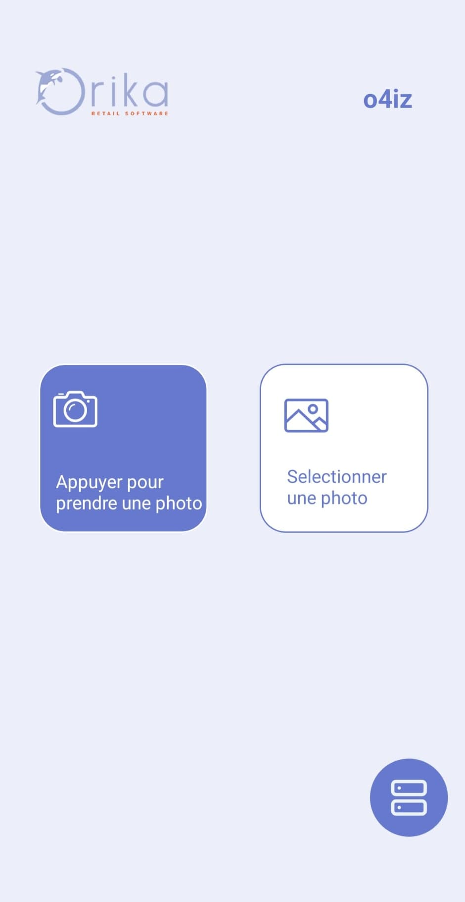
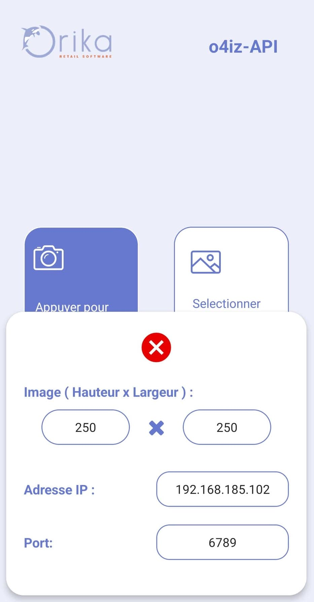
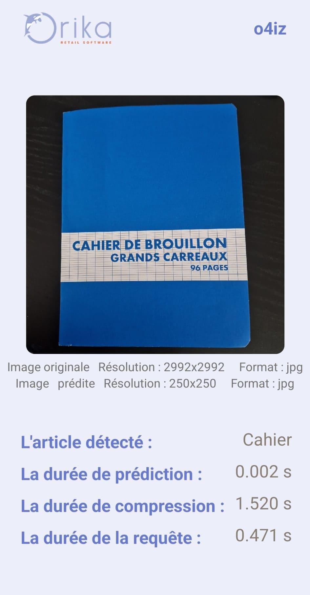
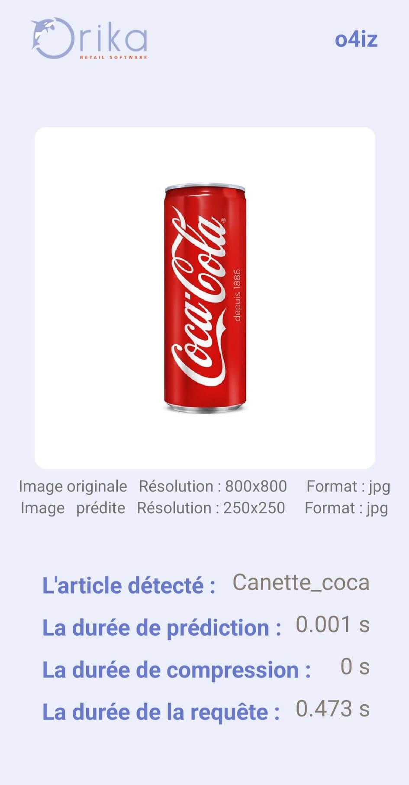

# Mobile application for product recognition : o4iz

## Specifications :

As part of the research and development, the company of my internship has developed a machine learning model that they have named the fraud model and that allows product recognition by camera . In order to test how well this model works as well as to provide the sales team with a powerful and simple tool to show clients how well the fraud model works. I developed a mobile application that will allow users to identify the product contained in an image.

We have developed the first version of o4iz in such a way that it allows users to configure the API to be queried (choice of IP address and port of the API) and to choose the size of the image in the compression we are going to do.

## Demo of o4iz :

<em>For prediction, the user has to choose the image to predict either from the gallery of his phone or by taking a quick picture.</em>

<em>The user has at his disposal a button to configure the API to query.</em>

<em>Examples of prediction of an image of a notebook taken by camera and an image of a coke can selected from the gallery.</em>

